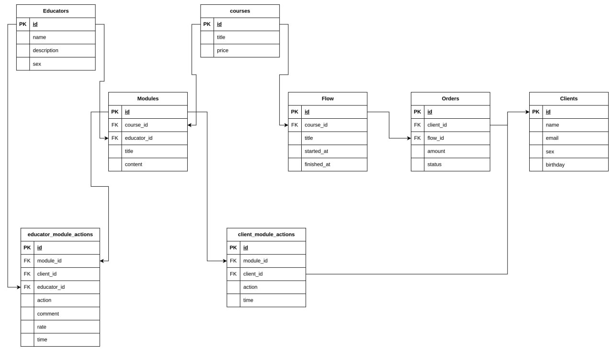

Задание:
Перенести схему базы данных на проект Laravel.
Созадть фабрики и сиды для наполнения таблицы.

Запуск:

`git clone https://github.com/SemenVologdin/flag.assessment.courses.git`

`cd flag.assessment.courses`

`composer install`

`php artisan serve`

